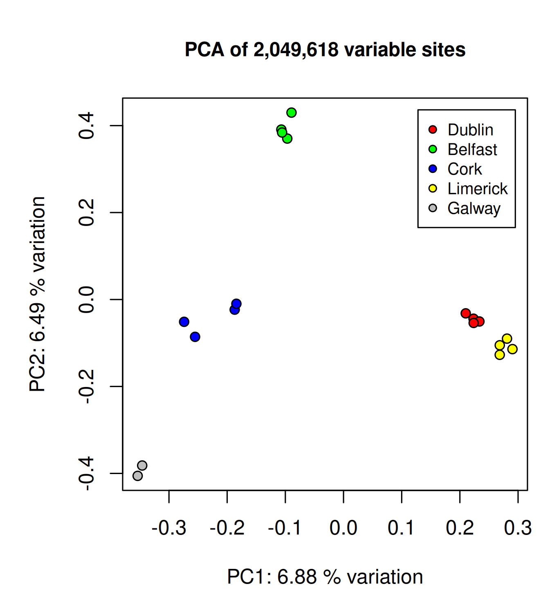

## Header 1

### Header 2

#### Header 3

You can just write stuff like this

- list1
- list2
  - sublist 1
  - sublist 2

1. Numbered list1
2. Numbered list2

**here is bold**

*here is italic*

`this is inline code`  

## Tables

Subject|Emotion|Object
--|--|--
I|hate|Powerpoint
I|love|Rmarkdown

## `R` code chunk


``` r
# here is some R code that is executed
1+1
```

```
## [1] 2
```

## Tables using external file


|sample  |locality |colour |bam                                      |
|:-------|:--------|:------|:----------------------------------------|
|adder17 |Belfast  |green  |2hy+adder17_ber_ursinii_chr7_1.01421.bam |
|adder13 |Limerick |yellow |34g+adder13_ber_ursinii_chr7_.95552.bam  |
|adder11 |Limerick |yellow |547+adder11_ber_ursinii_chr7_1.01000.bam |
|adder08 |Cork     |blue   |7f7+adder08_ber_ursinii_chr7_1.04511.bam |
|adder18 |Belfast  |green  |7Lx+adder18_ber_ursinii_chr7_1.01297.bam |
|adder12 |Limerick |yellow |ef1+adder12_ber_ursinii_chr7_.95648.bam  |
|adder14 |Limerick |yellow |eL1+adder14_ber_ursinii_chr7_1.01451.bam |
|adder10 |Cork     |blue   |i2f+adder10_ber_ursinii_chr7_.99929.bam  |
|adder01 |Dublin   |red    |Lbx+adder01_ber_ursinii_chr7_1.00762.bam |
|adder16 |Galway   |grey   |piq+adder16_ber_ursinii_chr7_.89471.bam  |
|adder02 |Dublin   |red    |pwm+adder02_ber_ursinii_chr7_1.02637.bam |
|adder03 |Belfast  |green  |qy7+adder03_ber_ursinii_chr7_1.07458.bam |
|adder07 |Cork     |blue   |rr0+adder07_ber_ursinii_chr7_1.01144.bam |
|adder15 |Galway   |grey   |urz+adder15_ber_ursinii_chr7_.37351.bam  |
|adder06 |Dublin   |red    |vb2+adder06_ber_ursinii_chr7_1.04132.bam |
|adder05 |Dublin   |red    |vys+adder05_ber_ursinii_chr7_.97694.bam  |
|adder04 |Belfast  |green  |wjq+adder04_ber_ursinii_chr7_1.03066.bam |
|adder09 |Cork     |blue   |xfx+adder09_ber_ursinii_chr7_1.09662.bam |

## `bash` code chunk (not exectuted)

```bash
# set ref genome as a variable
ref='/scratch/scw2141/BEARCAVE2/refgenomes/ursinii_chr7/vipera_ursinii_chromosome_7.fa'

# angsd command
angsd -doIBS 1 -doCov 1 -makeMatrix 1 -doCounts 1 -doMajorMinor 1 -GL 1 -minFreq 0.1 -minInd 18 -minQ 30 -minMapQ 30 -b bamlist -ref $ref -out bamlist_out -nThreads 10
```

## Insert image from external file

<div class="figure">

<p class="caption">male adder thinks R markdown is cool</p>
</div>

## Figures


